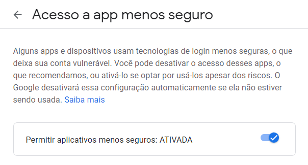

# Aula 8 - Email, DBs e OO

## smtplib

- **Liberar Acesso ao SMTP do Gmail:**
    - [https://myaccount.google.com/lesssecureapps](https://myaccount.google.com/lesssecureapps)
    - Tela de ativação:
        
        
        
- **Protocolos SMTP:**
    - Gmail: [https://support.google.com/a/answer/176600?hl=pt#zippy=%2Cusar-o-servidor-smtp-do-gmail](https://support.google.com/a/answer/176600?hl=pt#zippy=%2Cusar-o-servidor-smtp-do-gmail)
        - Link alternativo: [https://support.google.com/mail/answer/7126229?hl=pt-BR](https://support.google.com/mail/answer/7126229?hl=pt-BR)
    - Outlook: [https://support.microsoft.com/pt-br/office/configurações-pop-imap-e-smtp-para-outlook-com-d088b986-291d-42b8-9564-9c414e2aa040](https://support.microsoft.com/pt-br/office/configura%C3%A7%C3%B5es-pop-imap-e-smtp-para-outlook-com-d088b986-291d-42b8-9564-9c414e2aa040)
1. Importar as bibliotecas:
    
    ```python
    import smtplib
    from email.mime.multipart import MIMEMultipart
    from email.mime.text import MIMEText
    from email.mime.application import MIMEApplication
    ```
    
2. Instanciar o email:
    
    ```python
    mail = MIMEMultipart()
    ```
    
3. Criar o corpo do e-mail:
    
    ```python
    payload = """Olá! Tudo bem?
    
    Este é um e-mail automático para testar o disparo de e-mail ensinado pelo curso de RPA Python!
    
    Atenciosamente,
    
    RPA Pythonico
    """
    ```
    
4. Configurar o e-mail que está enviando:
    
    ```python
    mail['From'] = 'rpapythonico@gmail.com'
    ```
    
5. Configurar o(s) destinatário(s) do e-mail
    
    ```python
    # UM destinatário
    mail['To'] = 'rpapythonico@gmail.com'
    
    # MAIS DE UM destinatário
    mail['To'] = 'rpapythonico@gmail.com,seu_email@provedor.com'
    ```
    
6. Configurar o assunto do e-mail:
    
    ```python
    mail['Subject'] = 'Email Automático - SMTPLIB'
    ```
    
7. Formatar o corpo do e-mail em formato de texto:
    
    ```python
    mail.attach(MIMEText(payload, 'plain'))
    ```
    
8. Criar conexão SMTP:
    
    ```python
    server = smtplib.SMTP('smtp.gmail.com', '587')
    server.starttls()
    ```
    
9. Se autenticar no servidor SMTP:
    
    ```python
    server.login(msg['From'], 'sua_senha')
    ```
    
10. Enviar e-mail:
    - **SEM Anexo**
        
        ```python
        # UM destinatário
        server.sendmail(mail['From'], mail['To'], mail.as_string())
        
        # MAIS DE UM destinatário
        server.sendmail(mail['From'], mail['To'].split(","), mail.as_string())
        ```
        
    - **COM Anexo**
        
        ```python
        file = open('seu_arquivo.py', 'rb')
        
        app = MIMEApplication(file.read(), 'py')
        app.add_header('Content-Disposition', 'attachment;filename=seu_arquivo.py')
        mail.attach(app)
        
        # UM destinatário
        server.sendmail(mail['From'], mail['To'], mail.as_string())
        
        # MAIS DE UM destinatário
        server.sendmail(mail['From'], mail['To'].split(","), mail.as_string())
        ```
        
11. Finalizar conexão SMTP:
    
    ```python
    server.quit()
    ```
    

## Ferramentas DB

- **MS SQL:**
    - Download SQL Server: [https://www.microsoft.com/pt-br/sql-server/sql-server-downloads](https://www.microsoft.com/pt-br/sql-server/sql-server-downloads)
        - Selecionar a edição "Desenvolvedor"/"Developer".
        - Link direto: [https://go.microsoft.com/fwlink/?linkid=866662](https://go.microsoft.com/fwlink/?linkid=866662)
    
    - SQL Management Studio:
        - Página de download: [https://docs.microsoft.com/pt-br/sql/ssms/download-sql-server-management-studio-ssms?view=sql-server-ver15](https://docs.microsoft.com/pt-br/sql/ssms/download-sql-server-management-studio-ssms?view=sql-server-ver15)
        - Link direto: [https://aka.ms/ssmsfullsetup](https://aka.ms/ssmsfullsetup)
    - Biblioteca pyodbc:
        - Documentação pyodbc: [https://github.com/mkleehammer/pyodbc/wiki](https://github.com/mkleehammer/pyodbc/wiki)
        - Repositório pyodbc: [https://github.com/mkleehammer/pyodbc/](https://github.com/mkleehammer/pyodbc/)
- **SQLite:**
    - Programas pra usar o SQLite:
        - SQLite Browser: [https://sqlitebrowser.org/dl/](https://sqlitebrowser.org/dl/)
        - SQLite Studio: [https://sqlitestudio.pl/](https://sqlitestudio.pl/)
    - Programa para ler um arquivo ".db" do SQLite:
        - SQLite Viewer Online: [https://inloop.github.io/sqlite-viewer/](https://inloop.github.io/sqlite-viewer/)
    - Site SQLite:
        - [https://www.sqlite.org/index.html](https://www.sqlite.org/index.html)
    - Documentação sqlite3:
        - [https://docs.python.org/3/library/sqlite3.html](https://docs.python.org/3/library/sqlite3.html)
        - [https://www.sqlitetutorial.net/](https://www.sqlitetutorial.net/)

## sqlite3

- Importar biblioteca:
    
    ```python
    import sqlite3
    ```
    
- Criar conexão:
    
    ```python
    con = sqlite3.connect('example.db')
    ```
    
- Criar cursor:
    
    ```python
    cur = con.cursor()
    ```
    
- Criar uma tabela:
    
    ```python
    cur.execute('''CREATE TABLE "TB_Cliente"( "CPF" INTEGER NOT NULL UNIQUE, "Nome_Completo" TEXT NOT NULL, "Data_Nascimento" TEXT NOT NULL, "Telefone" TEXT, "Email" TEXT, "CEP" TEXT NOT NULL, PRIMARY KEY("CPF"));''')
    ```
    
- Aprovar as interações com o banco de dados:
    
    ```python
    con.commit()
    ```
    
- Inserir algum dado:
    
    ```python
    cur.execute('''INSERT INTO TB_Cliente VALUES (20955758572, 'Laura Luana Assis', '13/06/1948', '68991361938', 'lauraluanaassis-91@naressi.com.br', '69911355')''')
    con.commit()
    ```
    
- Inserir vários registros no banco:
    
    ```python
    lista_registros = [(88190475789, 'José Hugo Manuel Porto', '11/07/1997', '41989320821', 'jjosehugomanuelporto@patriciagrillo.adv.br', '83309270'), (39962955106, 'Marina Carolina dos Santos', '26/09/1995', '81984235792', 'marinacarolinadossantos_@lukin4.com.br', '53350130'), (20955758572, 'Laura Luana Assis', '13/06/1948', '68991361938', 'lauraluanaassis-91@naressi.com.br', '69911355'), (76938977550, 'Yasmin Evelyn Maria Costa', '20/04/1959', '91998657654', 'yasminevelynmariacosta-88@yahoo.com.ar', '66810020'), (25373027375, 'Fernando Giovanni Bernardes', '02/03/1964', '81989889726', 'fernandogiovannibernardes-92@soulcomunicacao.com.br', '51180440'), (85775491947, 'Clarice Vitória Teixeira', '24/02/1958', '82996438794', 'claricevitoriateixeira-97@india.com', '57052605'), (4847726278, 'Kamilly Clara Caldeira', '21/04/1982', '27998331799', 'kamillyclaracaldeira__kamillyclaracaldeira@caferibeiro.com.br', '29194248'), (90123303354, 'Carolina Cláudia Pietra da Rocha', '14/04/1952', '63992520221', 'carolinaclaudiapietradarocha__carolinaclaudiapietradarocha@riguetti.com.br', '77017297'), (96558670801, 'Levi Theo Matheus Ramos', '04/04/1961', '22988505045', 'levitheomatheusramos..levitheomatheusramos@cordeiromaquinas.com.br', '28024123'), (57218723306, 'Davi Márcio Rafael Nogueira', '25/07/1997', '69991521228', 'davimarciorafaelnogueira..davimarciorafaelnogueira@silnave.com.br', '76964042')]
    cur.executemany("INSERT INTO TB_Cliente VALUES (?, ?, ?, ?, ?, ?)", lista_registros)
    con.commit()
    ```
    
- Apagar algum dado:
    
    ```python
    cur.execute('''DELETE FROM TB_Cliente WHERE CPF = 88190475789''')
    con.commit()
    ```
    
- Atualizar algum dado:
    
    ```python
    cur.execute('''UPDATE TB_Cliente SET Telefone = NULL, Email = NULL WHERE CPF = 39962955106''')
    con.commit()
    ```
    
- Ver um dado na tabela:
    
    ```python
    cur.execute('''SELECT * FROM TB_Cliente''')
    cur.fetchone()
    # output: (116415509, 'Analu Julia da Paz', '05/04/1974', '79982386771', 'aanalujuliadapaz@alwan.com.br', '49026130')
    ```
    
- Ver todos os dados da tabela:
    
    ```python
    cur.execute('''SELECT * FROM TB_Cliente''')
    cur.fetchall()
    # Realizado slice ([:3) no output para apresentar pequenos exemplos
    # output: [(116415509, 'Analu Julia da Paz', '05/04/1974', '79982386771', 'aanalujuliadapaz@alwan.com.br', '49026130'), (4847726278, 'Kamilly Clara Caldeira', '21/04/1982', '27998331799', 'kamillyclaracaldeira__kamillyclaracaldeira@caferibeiro.com.br', '29194248'), (7287125803, 'Eduarda Emily Almada', '20/04/1941', '32985692709', 'eduardaemilyalmada_@peopleside.com.br', '36200142')]
    ```
    
- Fechar conexão do banco de dados:
    
    ```python
    con.close()
    ```
    

## **pyodbc**

- Instalar biblioteca:
    
    ```bash
    pip install pyodbc
    ```
    
- Importar biblioteca:
    
    ```python
    import pyodbc
    ```
    
- Criar conexão com o banco de dados:
    
    ```python
    # Com credenciais
    conn = pyodbc.connect('DRIVER={SQL Server};SERVER=localhost;DATABASE=TB_Cliente;UID=user;PWD=password')
    
    #Sem credenciais:
    conn = pyodbc.connect('DRIVER={SQL Server};SERVER=localhost;DATABASE=TB_Cliente')
    ```
    

## Utilitários DB

- Visualizar bancos de dados:
    - DBeaver: [https://dbeaver.io/?r=qal-sqle](https://dbeaver.io/?r=qal-sqle)
    - Beekeeper Studio: [https://www.beekeeperstudio.io/](https://www.beekeeperstudio.io/)
    - SqlDbx: [http://www.sqldbx.com/](http://www.sqldbx.com/)
- Outros Bancos de Dados:
    - MySQL: [https://www.mysql.com/](https://www.mysql.com/)
    - PostgreSQL: [https://www.postgresql.org/](https://www.postgresql.org/)
    - MariaDB: [https://mariadb.org/](https://mariadb.org/)
    - MongoDB: [https://www.mongodb.com/](https://www.mongodb.com/)
    - Apache Cassandra: [https://cassandra.apache.org/](https://cassandra.apache.org/_/download.html)
    - Redis: [https://redis.io/download](https://redis.io/download)
- "Minificar" a Query:
    - SQL-Minifier: [https://www.webtoolkitonline.com/sql-minifier.html](https://www.webtoolkitonline.com/sql-minifier.html)
- Carregar a tabela:
    - Necessário criar um arquivo ".db" e renomear dentro do arquivo.py
    - Deixar os arquivos ".json", ".db" e ".py" na mesma pasta
    - Arquivos:
        
        [Aula8.zip](Aula%208%20-%20Email,%20DBs%20e%20OO%201f458ef924dd473a952375a676f36154/Aula9.zip)
        
    

## Orientação à Objeto:

- Criar uma classe:
    
    ```python
    class Cachorro:
    ```
    
- Criar variáveis e ações da Classe ao chamá-la:
    
    ```python
    	def __init__(self, nome, idade, raca='Vira-Lata'):
    	  self._nome = nome.title()
        self._idade = int(idade)
        self._raca = raca.title()
    ```
    
    - Criar variáveis “privadas” da Classe:
        - Usar parênteses;
        
        ```python
        self._nome = nome.title()
        ```
        
- Inserir método de atualização do nome:
    
    ```python
    	def atualiza_nome(self, novo_nome):
    	  self._nome = novo_nome
    ```
    
- Inserir método de atualização da idade:
    
    ```python
    	def atualiza_idade(self, nova_idade):
    	  self._idade = nova_idade
    ```
    
- Inserir método de atualização da raça:
    
    ```python
    	def atualiza_raca(self, nova_raca):
    	  self._raca = nova_raca
    ```
    
- Inserir método que imprime as descrições do cachorro:
    
    ```python
    	def informacoes(self):
    	  print(f'O cachorro da raça {self._raca} se chama {self._nome} e possui {self._idade} anos.')
    ```
    
- Inserir método que faz o cachorro sentar:
    
    ```python
    	def sentar(self):
    	  print(f'O cachorro {self._nome} está sentado agora!')
    ```
    
- Inserir método que faz o cachorro rolar:
    
    ```python
    	def rolar(self):
    	  print(f'O cachorro {self._nome} está rolando agora!')
    ```
    
- Inserir método que faz o cachorro deita:
    
    ```python
    	def deitar(self):
    		print(f'O cachorro {self._nome} está deitado agora!')
    ```
    
- Importar uma Classe (vale destacar que para isso, você precisa estar no diretório em que foi criado o arquivo da classe):
    
    ```python
    from classe_cachorro import Cachorro
    ```
    
- Criar um objeto na Classe:
    
    ```python
    obj = Cachorro('Rex', 3, 'Shih Tzu')
    ```
    
- Acessar funcionalidades da classe com o objeto criado:
    
    ```python
    obj.informacoes()
    # output: O cachorro da raça Shih Tzu se chama Rex e possui 3 anos.
    ```
    
- Atualizar raça do cachorro contido no objeto:
    
    ```python
    obj.atualiza_raca('Terrier')
    ```