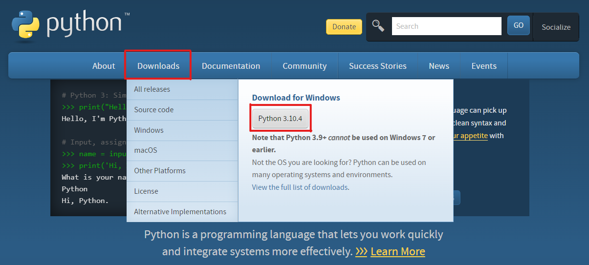
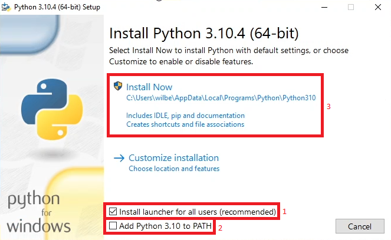
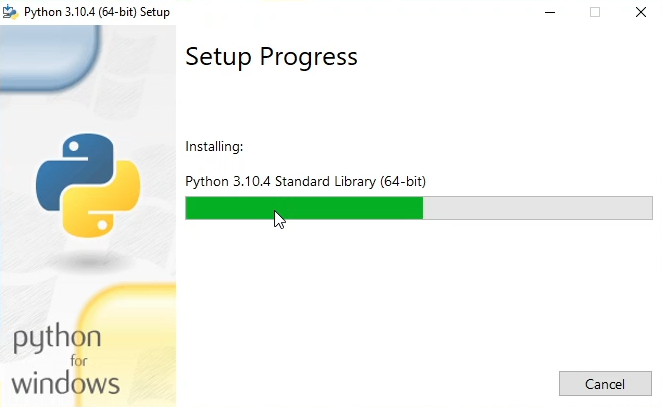
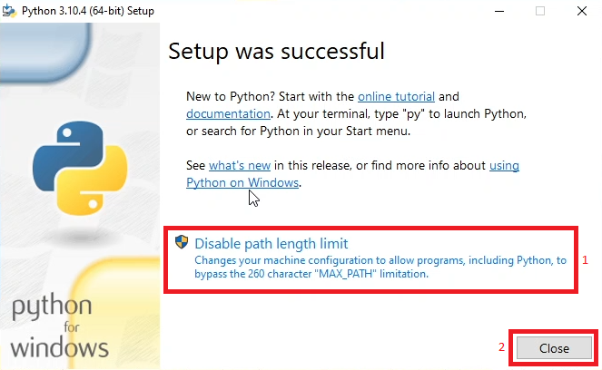

# Instalação do Python

## Baixando o executável no portal python.org

## Começando a instalação do Python

1. O campo "Install launcher for all users" só deve ficar assinalado se o equipamento estiver em conta administrador, caso contrário, o instalador irá gerar um erro;

2. Para que o Python seja instalado e facilite usar comandos direto em pastas e no CMD/Shell, é importante que esse campo esteja assinalado;

3. Após as devidas marcações e desmarcações, basta clicar em "Install Now".

## Aguardando a instalação concluir

## Finalizando a instalação

1. Se estiver em conta administrador, clicar em "Disable path length limit" permite com que o Windows ajuste a variável de ambiente "MAX_PATH" para permitir mais que 260 caracteres em caminhos de diretórios/arquivos durante o uso no Python;

2. Basta finalizar a instalação clicando em "Close".

