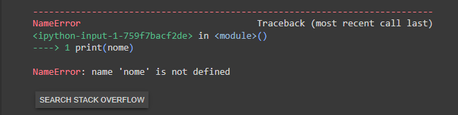
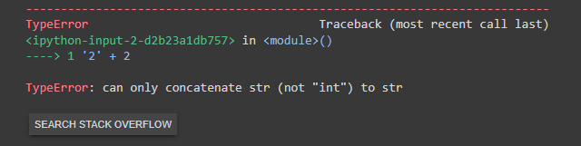
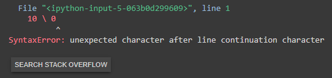
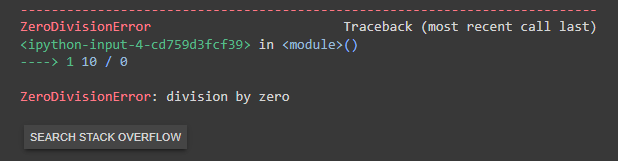

# Tratativas de Erros

## Tipos de Erros

- Variável **"nome"** não declarada:
  ```python
  print(nome)
  ```
  

- Soma entre **"string"** e **"integer"**:
  ```python
  '2' + 2
  ```
  

- Barra invertida como operador aritmético:
  ```python
  10 \ 0
  ```
  


- Divisão de um valor por zero:
  ```python
  10 / 0
  ```
  

## Explicação

Para que um código não "quebre" e acabe parando uma automação ou um script, é necessário fazer uma tratativa de erro. Para isso, o Python possui quatro palavras reservadas: **try**, **except**, **else** e **finally**.

- try:
    - Bloco que **executará o código principal**.
- except:
    - Bloco que criará um **caminho alternativo** à tentativa realizada anteriormente **em caso de falha**;
    - Pode ser especificada ([conforme documentação](https://docs.python.org/3/library/exceptions.html#exception-hierarchy)) ou de forma genérica.
- else:
    - Bloco que efetuará a **continuação do código** escrito dentro do **try** em caso de sucesso.
- finally:
    - Bloco que **executará código independente** do **SUCESSO** ou **FALHA**

## Exemplo

```python
def divisao(x, y):
  try:
    result = x / y
  except ZeroDivisionError:
    print('Erro de Divisão por Zero!')
  except:
    print('Erro não mapeado! E AGORA???')
  else:
    print(f'O resultado da divisão entre {x} e {y} é {result}')
  finally:
    print('Independente do que acontecer, sempre estarei aqui!')
```


# Personalizando Um Erro

## Explicação

O Python possui diversos erros já mapeados com textos prontos, porém é importante frisar que é possível personalizar a mensagem deles. Para isso, a linguagem conta com a palavra reservada **raise**.

## Exemplo

```python
idade = 17

if idade < 18:
  raise SystemError('Acesso proibido!')
else:
  print('Acesso permitido!')
```


