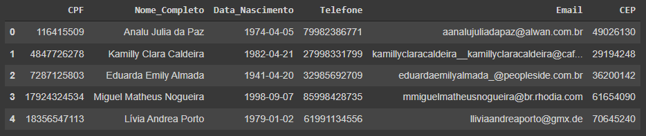

# Pandas

## Explicação

Pandas é uma biblioteca do Python que permite extrair dados de diversos arquivos, como Excel, Json, HTML, SQL, etc...

A mesma possui funcionalidades voltadas para análises de dados e ferramentas de manipulação de tabelas.

## Glossário

### DataFrame

Estrutura para dados que é composta de duas dimensões, estas sendo linhas e colunas. Assemelha-se à uma tabela de Excel.



### Series

Estrutura de dados de uma dimensão, sendo basicamente composta dos valores de uma linha ou coluna que representa apenas uma fatia do DataFrame.


## Comandos

- Instalando a biblioteca

    ```bash
    pip install pandas
    ```

- Importando a biblioteca
    ```python
    import pandas as pd
    ```

- Lendo um arquivo Excel
    ```python
    df = pd.read_excel("tabela_clientes.xlsx")
    ```

- Resumo das dimensões do DataFrame
    ```python
    df.shape
    ```

- Ver nome das colunas
    ```python
    df.columns
    ```

- Ver os primeiros resultados
Como padrão a quantidades de linhas à ser trazido são cinco, porém esse valor pode ser alterado se preenchido os parênteses de acordo com o desejado.
    ```python
    df.head()

    # ou

    df.head(20)
    ```

- Ver os últimos resultados
    ```python
    df.tail()
    ```

- Selecionar uma coluna específica - pelo nome
O segundo método apresentado no exemplo somente é permitido de usar em nomes de colunas sem espaço entre palavras.

    ```python
    df["Nome_Completo"]

    # ou

    df.Nome_Completo
    ```

- Selecionar o primeiro valor de uma coluna específica
    ```python
    df["Nome_Completo"].values[0]
    ```

- Selecionar uma linha através do index
    ```python
    df.iloc[0]
    ```

- Selecionar uma linha e uma coluna através do index
    ```python
    df.iloc[0,0]
    ```

- Criando um DataFrame
    ```python
    data = {
        "Nome": ["Harry", "Hermione", "Rony", "Luna", "Neville"],
        "Herbologia": [8,5,6,9,7],
        "Alquimia": [7,9,5,4,7],
        "Adivinhacao": [7,4,7,6,8]
    }

    df_hp = pd.DataFrame(data)
    ```

- Estatísticas descritivas das colunas - media, desvio padrão, mínimo, máximo, etc ...
    ```python
    df.describe()
    ```

- Extraindo o DataFrame em um arquivo Excel
    ```python
    df_hp.to_excel("Boletins_Alunos.xlsx", index=False)
    ```