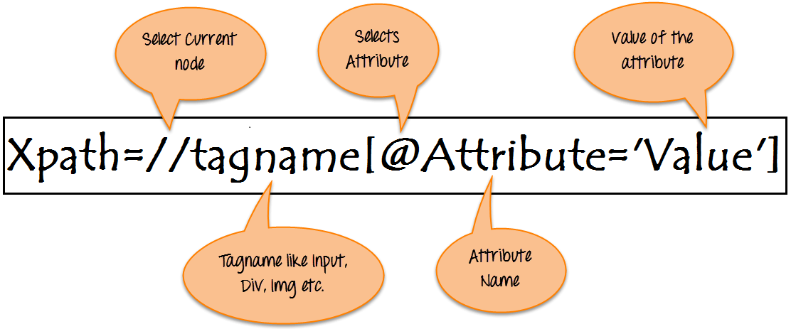

# Selenium - Visão Geral

## O que é?

Selenium é um pacote open source de ferramentas que permitem automatizar interações web, podendo ser utilizado para fazer crawlers/scrapers ou testes automatizados.

Explicação baseada na [documentação](https://www.selenium.dev/documentation/).

## Como o Selenium se integra ao navegador?

Essa integração é feita através de um executável que é chamada de **webdriver**, a mesma permite as devidas interações entre código e browser.

Hoje, esses drivers existem para todos (ou quase todos) os navegadores mais utilizados, conforme tabela abaixo:

| Navegador         | SO Suportados               | Mantido por      | Baixar | Problemas Encontrados |
| ----------------- | --------------------------- | ---------------- | ------ | --------------------- |
| Chromium/Chrome   | Windows/macOS/Linux         | Google           | [Link](https://chromedriver.storage.googleapis.com/index.html) | [Problemas](https://bugs.chromium.org/p/chromedriver/issues/list) |
| Firefox           | Windows/macOS/Linux         | Mozilla          | [Link](https://github.com/mozilla/geckodriver/releases) | [Problemas](https://github.com/mozilla/geckodriver/issues) |
| Edge              | Windows/macOS               | Microsoft        | [Link](https://developer.microsoft.com/en-us/microsoft-edge/tools/webdriver/) | [Problemas](https://github.com/MicrosoftDocs/edge-developer/issues) |
| Internet Explorer | Windows                     | Selenium Project | [Link](https://www.selenium.dev/downloads) | [Problemas](https://github.com/SeleniumHQ/selenium/labels/D-IE) |
| Opera             | Windows/macOS/Linux         | Opera Software   | [Link](https://github.com/operasoftware/operachromiumdriver/releases) | [Problemas](https://github.com/operasoftware/operachromiumdriver/issues) |
| Safari            | macOS High Sierra and newer | Apple            | Embutido | [Problemas](https://bugreport.apple.com/logon) |

Informações extraídas e traduzidas da [documentação oficial](https://www.selenium.dev/documentation/webdriver/getting_started/install_drivers/) do Selenium.

**Obs.:** O driver do Opera não suporta a sintaxe w3c, então é recomendado seguir com o uso do chromedriver para trabalhar com o navegador Opera.

E assim como todo sistema sofre atualização, com os navegadores não é diferente. O Python nos traz algumas bibliotecas que podem mitigar o risco de um navegador atualizar e o nosso webdriver ficar retrógrado. As mais utilizadas são:

- [webdriver-manager](https://pypi.org/project/webdriver-manager/)
- [pyderman](https://pypi.org/project/pyderman/)


## Mas afinal, como é feito a interação com a página web?

A internet é composta de requisições e linguagens de formatação e estilização. Com isso, para interagir com uma página, será necessário entender o que é o DOM de uma página.

A página web possui **tags** com seus respectivos **atributos** (HTML) que permitem adicionar funcionalidades e/ou estilos (CSS). Além disso, as páginas contém linguagens scriptadas que permitem monitorar ações e realizar determinadas atividades quando alguma interação for realizada, este é o caso da linguagem JavaScript. Através dele, é permitido efetuar “injeções” de scripts.

Para entender melhor, o Selenium irá trabalhar com:

- id;
    - Atributo **identificador** de alguma tag. Geralmente são **únicos** e **imutáveis**.
- name;
    - Atributo que **nomifica** uma tag. Geralmente são **únicos** e **podem sofrer alteração**.
- class_name;
    - Atributo que permite classificar um **grupo de tags** com a mesma regra de estilização. Ou seja, pode ter **um ou mais**.
- tag_name;
    - Tag HTML do elemento à ser inspecionado.
- partial_link_text;
    - Parte do texto contido entre a tag de abertura e fechamento. Geralmente aparece em tags de link (\<a\>).
- link_text;
    - Texto contido entre a tag de abertura e fechamento. Geralmente aparece em tags de link (\<a\>).
- css_selector;
    - Padrão de elementos/termos baseados em tags e atributos junto ao CSS.
- xpath.
    - Padrão de elementos/termos baseados em tags e atributos.

## Criando CSS Selector

Sintaxe: **tag[atributo="valor"]**

- Guia: [https://www.w3schools.com/cssref/css_selectors.asp](https://www.w3schools.com/cssref/css_selectors.asp)
- Cheat Sheet: [https://devhints.io/css](https://devhints.io/css)
- Extra: [https://www.freecodecamp.org/news/css-selectors-cheat-sheet/](https://www.freecodecamp.org/news/css-selectors-cheat-sheet/)


## Criando Xpath


Imagem retirada do site [guru99](https://www.guru99.com/).

### Conteúdos extras

- Guia de criação de Xpath: [https://www.guru99.com/xpath-selenium.html](https://www.guru99.com/xpath-selenium.html)
- Extra: [https://devhints.io/xpath](https://devhints.io/xpath)

## Exemplos

### CSS Selector

- Coleta através do ID
    ```
    #SIvCob

    ou

    div#SIvCob
    ```

- Coleta através da CLASS NAME
    ```
    .gb_Jd

    ou

    div.gb_Jd
    ```


- Pesquisa com Sintaxe Completa
    ```
    input[class="gLFyf gsfi"]
    ```

- Pesquisa Utilizando uma Tag Filha
    ```
    div[class="RNNXgb"] input
    ```

- Pesquisa Através da Parcela de um Texto Entre Tags
    ```
    input[value*="Pesquisa"]
    ```
### Xpath

- Pesquisa com Sintaxe Completa
    ```
    //*[@id="SIvCob"]
    ```

- Pesquisa Utilizando Tags Filhas
    ```
    //div[@class="RNNXgb"]/div/div[2]/input
    ```
- Pesquisa Através do Texto Entre Tags
    ```
    //div[text()="Disponibilizado pelo Google em:  "]
    ```

- Pesquisa Através da Parcela de um Texto Entre Tags
    ```
    //div[contains(text(), 'Disponibilizado')]
    ```